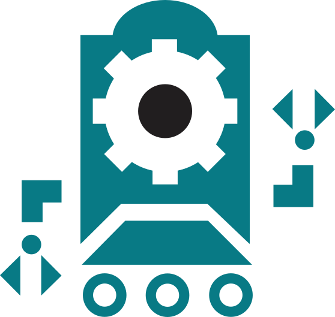

# Nicolet FEAR Programing

## Passion - Inovation - Relationships

> Since 2013

***Over 90 Students and Mentors, Past and Present***

## About us

Nicolet FEAR is an [FRC](https://en.wikipedia.org/wiki/FIRST_Robotics_Competition) team based out of Milwaukee Wisconsin, founded with the goal of giving people the tools and opportunities to grow and impact the world through a team environment.

Our programing team works as a subdivision of our Strategic Design Systems keystone group, and works both on the robot and on scouting.

## Follow us

    
    

